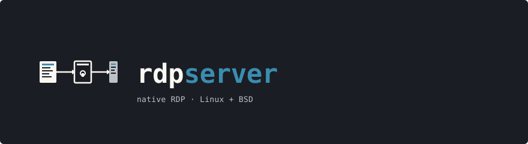

<p align="center">
  
</p>

<p align="center">
  <a href="./LICENSE">
    
  </a>
  
  
  
  
</p>

---

`rdpserver` is a Remote Desktop Protocol server written from scratch in C.
It implements the RDP wire format directly — **no FreeRDP, no Xvnc, no
intermediate VNC protocol anywhere** — and presents a real graphical
login screen over RDP before any user session exists. Once you sign in,
the server spawns a fresh per-user X11 session for you, exactly like
the Remote Desktop service on Windows.

Two daemons and one user-mode helper cooperate behind a privilege-
separation boundary:

```
TCP/3389 ── TLS ──> rdpd (root)
                     │  X.224 / MCS / NLA (CredSSP/NTLMv2) / RDP wire
                     │  CLIPRDR / RDPGFX / RDPSND / RDPDR
                     ▼
                     rdp-sessionmgr (root)
                     │  PAM (Linux) or bsd_auth (OpenBSD)
                     │  auto-caches NT hashes for NLA
                     │  fork + setresuid + exec
                     ▼
                     rdp-session (user)
                        Xvfb + xterm + XShm capture + XTest input
```

The greeter is painted with RDP fast-path bitmap updates over a CPU
framebuffer; an embedded 8x16 PSF font renders the labels and typed
text. After auth, `rdp-session` captures frames and streams raw
pixels over the backend RPC socket to `rdpd`, which encodes them
with H.264 (libx264) and wraps the bitstream in RDPGFX AVC420 PDUs
when the client negotiated the graphics pipeline (otherwise it
sends fast-path bitmap updates).

> **Status: alpha.** Verified end-to-end against `xfreerdp`,
> Microsoft `mstsc.exe` (Windows 11), Microsoft Remote Desktop
> (macOS and Android).  NLA/CredSSP works with all Microsoft clients.
> See [`docs/SECURITY.md`](./docs/SECURITY.md) for the trust model.

## Features

- **Native RDP wire protocol** — TPKT (RFC 1006), X.224 Class 0, T.125 MCS, BER + GCC PER, security header, MS-RDPELE licensing, capability negotiation, finalization, fast-path output and input.  No FreeRDP runtime.
- **Windows-style greeter** — TLS-only handshake, then a server-painted login dialog (centred panel, Username + Password fields with masking, Login button, status line).  Tab cycles focus, Enter submits, Backspace deletes, Esc cancels.  The greeter itself uses a US-layout scancode → ASCII map; the logged-in session follows the client's keyboard layout (LCID).
- **Real PAM / bsd_auth** — `rdp-sessionmgr` is a separate privileged daemon.  Linux/FreeBSD/NetBSD use PAM via the `login` service by default (override with `-S rdpd` + an `/etc/pam.d/rdpd` stack); OpenBSD calls `auth_userokay(3)` and links `-lutil`.  Failed auth turns the greeter status line red; the password is `mlock`'d and `explicit_bzero`'d immediately after.
- **Per-user X session** — on successful login the session manager forks, `initgroups` + `setresgid` + `setresuid` to the target user, exec's `rdp-session`, which spawns `Xvfb :N -screen 0 WxHx24 -nolisten tcp -noreset` and an `xterm` for it.  Frames flow back via a `SOCK_STREAM` socketpair handed in via `SCM_RIGHTS`.
- **MIT-SHM capture, XTest injection** — root-window pixels grabbed via `XShmGetImage` (falls back to `XGetImage`), input replayed via `XTestFakeKeyEvent` and `XTestFakeButtonEvent`.  PC/AT scancode + 8 maps directly to evdev keycodes; the session's Xvfb keyboard layout is set from the client's reported layout (LCID) via `setxkbmap` (US fallback for unknown layouts), so those keycodes produce the client's characters (e.g. an AZERTY client types correctly).  Unicode keystrokes (fast-path Unicode events, e.g. on-screen keyboards and non-US text) are injected by remapping a spare keycode to the target keysym and faking a press/release.
- **Bidirectional clipboard** — MS-RDPECLIP static virtual channel, text formats (CF_UNICODETEXT).  Copy in the remote `xterm` and paste in your local clipboard; copy locally and paste in `xterm`.  `XFixesSelectSelectionInput` watches the X CLIPBOARD selection and the worker bridges to the RDP channel via the backend RPC.
- **Clean disconnect** — properly framed MCS Disconnect Provider Ultimatum (X.224 DT + TPKT, no Send-Data nesting), Shutdown Request answered with Shutdown Denied so clients send a graceful MCS Disconnect, `SO_KEEPALIVE` + `TCP_KEEPIDLE/INTVL/CNT` on accepted sockets so half-open TCP is detected within ~2 minutes.
- **Hardened build** — `-Werror -Wall -Wextra -Wshadow -Wstrict-prototypes -Wpointer-arith -Wcast-qual -Wundef -Wformat=2 -fstack-protector-strong -D_FORTIFY_SOURCE=2 -fPIE -pie -Wl,-z,relro,-z,now,-z,noexecstack` by default.  `./configure --enable-sanitizers` swaps in `-fsanitize=address,undefined`.  An in-tree fuzzer (`make fuzz`) drives 9 parsers with random bytes; 2.1 million iterations across three seeds under ASan + UBSan, zero crashes, zero UB.
- **OpenBSD `pledge(2)`** — `rdpd` worker pledges `stdio inet unix rpath wpath cpath sendfd recvfd`; `rdp-sessionmgr` pledges `stdio rpath wpath cpath unix sendfd recvfd proc exec id getpw dpath fattr`; `rdp-session` pledges `stdio rpath wpath cpath unix proc`.  On non-OpenBSD the calls compile to a no-op via the `compat.h` shim.  Linux seccomp-bpf sandbox is wired and allowlists the required syscalls.
- **One configure script, two OSes** — hand-rolled POSIX `sh` (no autotools, no CMake).  Probes for libtls or OpenSSL, PAM or bsd_auth, getrandom or arc4random, epoll or kqueue, pledge / unveil / capsicum / seccomp, X11 dev libs, `Xvfb` path.  Builds clean under both bmake and GNU make.

## What works today vs not yet

| | Status | Notes |
| --- | --- | --- |
| TLS, MCS connect, channel join | ✓ | TLS 1.2 or 1.3 (1.3 preferred, 1.2 floor). |
| Demand Active / Confirm Active / finalization | ✓ | |
| Fast-path Bitmap Update output (24bpp, tiled) | ✓ | |
| Fast-path input (scancode, mouse, sync, Unicode) | ✓ | Scancode and mouse forwarded to the session; Unicode events forwarded and injected via a spare-keycode keysym remap; sync (lock-key state) is parsed but not forwarded. |
| Server-painted greeter + PAM/bsd_auth | ✓ | |
| Per-user Xvfb + xterm session | ✓ | |
| CLIPRDR clipboard, bidirectional, text formats | ✓ | |
| Clean disconnect, Shutdown Request, TCP keepalive | ✓ | When the session backend exits, the server sends a Set Error Info PDU (logged-off) so the client shows a reason instead of a silently dropped connection. |
| Output suppression (Suppress Output / Refresh Rect) | ✓ | When the client minimizes it sends `SUPPRESS_OUTPUT`; the server then drains backend frames without encoding or sending them, saving CPU and bandwidth on a backgrounded session, and resumes on the next allow-updates or `REFRESH_RECT`. |
| NLA / CredSSP / NTLMv2 | ✓ | Full CredSSP v6 flow with NTLMv2 verification.  NT hashes are auto-cached by the session manager on first successful authentication, so no manual setup is needed.  Microsoft clients (mstsc, macOS, Android) connect via NLA directly.  Credentials are extracted from TSPasswordCreds and verified via PAM/bsd_auth. |
| RDPGFX / H.264 (AVC420) | ✓ | `rdp-session` sends raw frames over the backend socket; the `rdpd` worker encodes them with libx264 and wraps the bitstream in RDPGFX AVC420 WireToSurface1 PDUs.  CapsAdvertise negotiation selects the best AVC-capable version the client supports (v10.x preferred, v8.1 fallback).  FrameAcknowledge flow control prevents overwhelming the client decoder.  xfreerdp, which advertises v8.1 with AVC420_ENABLED, is always offered AVC.  Microsoft clients (mstsc, macOS Windows App) advertise AVC only by omitting AVC_DISABLED from a v10.x capset; offering them AVC is opt-in via `rdpd -V` and off by default, because such a client may advertise AVC yet be unable to decode it (for example a Microsoft client on a host with no GPU), in which case it tears down the graphics channel and ends the session rather than falling back.  When AVC is not offered the client is served fast-path bitmap.  Fragmented DRDYNVC messages are reassembled. |
| Audio output (RDPSND / MS-RDPEA) | ✓ | PCM 16-bit stereo 44.1 kHz streamed via SNDC_WAVE2 PDUs; also advertises G.711 A-law, and with `rdpd -W` prefers A-law (half the wire bandwidth) when the client supports it.  PulseAudio on Linux (auto-creates a per-session null sink), sndio on OpenBSD.  Audio from apps playing in the session is captured and forwarded to the RDP client in real time. |
| Drive / printer / serial redirection | ✓ | RDPDR channel with capability exchange, device enumeration, and IRP dispatch for drive file I/O.  Supports Create, Read, Close, and QueryDirectory IRPs with completion tracking.  The session can request file operations on client drives via the backend protocol; the worker relays them as IRPs and forwards completions back. |
| Session reconnect (auto-reconnect cookie) | ✓ | Save Session Info PDU with ARC cookie, sessmgr SUSPEND/RESUME ops with fd passing.  Sessmgr retains a dup of the backend fd at spawn time and auto-suspends on worker death, so sessions survive worker SIGKILL.  Dead fds are validated at resume and reaped by sweep. |
| Dynamic resize (RDPEDISP via DRDYNVC) | ✓ | xfreerdp with `/dynamic-resolution`: the server opens the Display Control channel (MS-RDPEDISP) and advertises its monitor limits (DISPLAYCONTROL_CAPS), then on a client layout request sends Deactivate-All + re-Demand-Active at new geometry and rdp-session resizes Xvfb via xrandr. Apps survive the resize. On a GFX (AVC420/Progressive) session the RDPGFX surface is recreated at the new size (RESET_GRAPHICS + CreateSurface + MapSurface, with a fresh keyframe) so the accelerated output tracks the resize. |
| Multi-monitor | ✓ | Parses CS_MONITOR from the GCC handshake, computes bounding box across up to 16 monitors.  RDPEDISP handles dynamic monitor layout changes mid-session.  The session runs at the combined resolution. |
| Native Xorg DDX driver | ✓ | `rdpserverdev_drv.so` renders to a POSIX shm framebuffer inside Xorg, reports dirty regions via the Damage extension over a control socket.  rdp-session mmaps the framebuffer and sends only changed regions to rdpd.  Use `-D` flag to select DDX mode instead of Xvfb. |
| Wayland backend | ✓ | wlroots-based headless compositor with xdg_shell, embedded in rdp-session via `-W` flag.  Wayland-native apps connect directly; framebuffer captured from client surface buffers.  Requires libwlroots 0.18+. |

## Supported clients

The protocol is the standard one (MS-RDPBCGR, MS-RDPECLIP), so any
RDP client should work.  Live-tested against:

| Client | Notes |
| --- | --- |
| `xfreerdp` (FreeRDP 3.x) | Primary test client.  `xfreerdp /v:host:3389 /cert:ignore /size:1024x768 +clipboard /sec:nla`. |
| Microsoft `mstsc.exe` (Windows 11) | Verified working via NLA.  Served fast-path bitmap by default; RDPGFX AVC (v10.x) is available with `rdpd -V` for hosts whose clients have a working H.264 decoder. |
| Microsoft Remote Desktop (macOS) | Verified working via NLA.  Connects directly without greeter. |
| Microsoft Remote Desktop (Android) | Verified working via NLA. |
| Remmina | Uses FreeRDP under the hood; should work. |
| `rdesktop` (legacy) | Older PDU shapes; not yet exercised. |

## Acceleration conditions

Graphics are sent as H.264 / AVC420 frames over the RDPGFX graphics pipeline when the client negotiates it; otherwise the server falls back to fast-path bitmap updates.  Whether AVC is offered depends on what the client advertises in its GFX `CapsAdvertise` and on the `rdpd -V` flag:

| Client GFX advertise | `rdpd -V` | Server offers | Result |
| --- | --- | --- | --- |
| v8.1 with `AVC420_ENABLED` (xfreerdp) | off or on | AVC420 (always) | H.264 accelerated |
| v10.x without `AVC_DISABLED` (mstsc, macOS) | off (default) | nothing | fast-path bitmap |
| v10.x without `AVC_DISABLED` (mstsc, macOS) | on | AVC420 (v10.2) | accelerated only if the client can decode H.264 |
| v10.x with `AVC_DISABLED` (e.g. Android) | off or on | nothing | fast-path bitmap |
| no GFX channel advertised | n/a | n/a | fast-path bitmap |

`xfreerdp` sets the v8.1 `AVC420_ENABLED` flag, so it is always offered AVC.  Microsoft clients (mstsc, macOS) signal AVC only by omitting `AVC_DISABLED` from a v10.x capset; offering them AVC is opt-in via `rdpd -V` and **off by default**.  A v10.x client can advertise AVC yet be unable to decode it (for example a Microsoft client on a host with no GPU), in which case it tears down the graphics channel with a `0xd06` error and ends the session instead of falling back to bitmap.  With the default off, those clients get bitmap and render normally; only xfreerdp, which keeps the session alive when the GFX channel closes, recovers gracefully when AVC is declined mid-session.

Whichever version is chosen, the server confirms only a version the client actually advertised, and only after its libx264 encoder opens.  If no advertised version is usable, or the encoder cannot start, it sends no `CapsConfirm` and the client falls back to bitmap rather than waiting for frames that never arrive.

As an alternative to AVC, `rdpd -P` offers **RFX Progressive** (MS-RDPEGFX `RFX_PROGRESSIVE`) to GFX-capable clients that are not given AVC.  It is a CPU-decodable wavelet codec that needs no client GPU (the same codec the Microsoft server uses for its GPU-less sessions), so it can accelerate mstsc, macOS, and Android clients without the `0xd06` teardown.  Off by default; the per-frame WireToSurface2 codec id selects it, so enabling it never changes clients that receive AVC.

For an accelerated session to work end to end:

- The server encodes with **libx264** on the CPU; there is no GPU encode path.  Frames are rounded to even dimensions for 4:2:0.
- Large keyframes (GFX PDUs over 64 KB) are split into ZGFX multipart segments, without which the client decoder tears down the channel.
- The first frame to a freshly created RDPGFX surface is forced to an IDR keyframe (rather than waiting for the periodic 60-frame keyframe), so the client never has to decode a P-frame referencing surface data it discarded on reset.
- The client must have a working H.264 decoder.  `xfreerdp` uses libavcodec (and can GPU-decode via VA-API/VDPAU/NVDEC or VideoToolbox); Microsoft clients need a GPU decoder.

See [`rdpd(8)`](./docs/man/rdpd.8) for the `-V` flag.

## Build

```sh
./configure
make
```

The hand-rolled `configure` probes the host and writes `config.mk` +
`src/include/config.h`.  Useful flags:

| Flag | Effect |
| --- | --- |
| `--prefix=PATH` | Install prefix (default `/usr/local`). |
| `--with-tls=libtls\|openssl` | Force a TLS backend; default `auto`. |
| `--with-auth=pam\|bsd_auth` | Force an auth backend; default `auto`. |
| `--enable-debug` | `-O0 -g3`, no `NDEBUG`. |
| `--enable-sanitizers` | `-fsanitize=address,undefined`; drops `_FORTIFY_SOURCE`.  Implies `--enable-debug`. |
| `--disable-hardening` | Drops `-fPIE`, `-fstack-protector-strong`, `-D_FORTIFY_SOURCE=2`, and the relro/now link flags. |

Targets `make`, `make regress`, `make fuzz`, `make clean`, `make
distclean`, `make install`.  Builds clean under GNU make (Linux) and
bmake (OpenBSD).

### Dependencies

| | Linux | OpenBSD | macOS |
| --- | --- | --- | --- |
| TLS | OpenSSL 1.1+/3.x | LibreSSL (base) | `brew install openssl@3` |
| Auth | libpam | bsd_auth (base + `-lutil`) | PAM (system) |
| X11 | `libx11-dev`, `libxdamage-dev`, `libxtst-dev`, `libxfixes-dev`, `libxext-dev` | base X11 (`/usr/X11R6`) | XQuartz (`/opt/X11`) |
| H.264 | `libx264-dev` | `pkg_add x264` | `brew install x264` |
| X server | `xvfb` | `xvfb` package (or base) | XQuartz |
| Audio (optional) | `libpulse-dev` | sndio (base) | CoreAudio (system) |
| DDX driver (optional) | `xserver-xorg-dev` | Xorg SDK | XQuartz SDK |

## Run

The two daemons run separately.  For development:

```sh
# Terminal 1 (or via doas / sudo): the privileged session broker
doas ./src/sessionmgr/rdp-sessionmgr -f -d \
    -s /tmp/sessmgr.sock \
    -X $(pwd)/src/session/rdp-session

# Terminal 2: the RDP listener (root only needed for port 3389)
./src/daemon/rdpd -f -d -p 13389 -S /tmp/sessmgr.sock

# Terminal 3: any RDP client
xfreerdp /v:127.0.0.1:13389 /cert:ignore /size:1024x768 +clipboard
```

`rdpd` and `rdp-sessionmgr` install to `$PREFIX/sbin` via `make
install`.  A sample `/etc/pam.d/rdpd` lives in
[`contrib/pam.d/rdpd`](./contrib/pam.d/rdpd).
Systemd unit files are in
[`contrib/systemd/`](./contrib/systemd/)
and OpenBSD rc.d scripts in
[`contrib/rc.d/`](./contrib/rc.d/).

## Project layout

```
src/include/      public headers + backend vtable + generated config.h
src/common/       buffers, I/O, log, mem, rand, str, utf16, BER, PER
src/wire/         RDP wire protocol: tpkt, x224, mcs, sec header,
                  license, capset, share-control PDUs, fast-path
src/sec/          TLS (OpenSSL/LibreSSL); NLA framework (cssp, ntlm,
                  nla_crypto, nla)
src/channels/     CLIPRDR, DRDYNVC, RDPSND, RDPGFX
src/ddx/          native Xorg DDX video driver module
src/greeter/      embedded font, paint primitives, keymap, dialog
                  state machine
src/daemon/       rdpd main + per-connection state machine
src/sessionmgr/   rdp-sessionmgr broker, PAM and bsd_auth backends,
                  worker-side client library
src/session/      rdp-session per-user helper, Xvfb spawn, MIT-SHM
                  capture, XTest injection, X11 clipboard bridge
src/backend/      backend RPC (HELLO / FRAME / INPUT / CLIP / BYE)
regress/common/   unit tests for the helpers
regress/wire/     unit tests for the wire encoders
regress/fuzz/     in-tree mini-fuzzer (9 parsers)
regress/integ/    Python integration test driving the daemon through
                  Channel Join
tools/            mkfont.py (PSF -> C array), add_license.sh,
                  test helpers
docs/             ARCHITECTURE.md, PROTOCOL.md, SECURITY.md, ROADMAP.md,
                  man pages (rdpd.8, rdpd.conf.5, rdp-sessionmgr.8,
                  rdp-session.8)
contrib/          PAM stack, systemd unit, rc.d scripts, example config
```

## Tests

```sh
make regress           # unit tests, returns 0 on success
make fuzz              # 5000-iter smoke pass over each parser
./regress/integ/connect_test.py    # drives a live daemon through MCS
```

Unit tests run cleanly under `--enable-sanitizers` with no leaks or UB
diagnostics.  The fuzzer has logged 2.1 million random-byte iterations
across the 9 parsers (tpkt, x224, ber, per, mcs, cliprdr, fp_input,
cssp, ntlm) under ASan + UBSan without a single crash.

## Security model

See [`docs/SECURITY.md`](./docs/SECURITY.md) for the trust model,
process layout, `pledge` promise sets, and the explanation of why NLA
is currently a framework-only feature.

The NLA token file (`.tok`) is opened with `O_EXCL` to prevent
creation races, unlinked immediately after open to prevent a second
worker from reading the same token, and protected by a random 16-byte
nonce that must be presented with the `NLA_AUTH` session manager
command. The NTLM challenge timestamp is written in little-endian
byte order for correctness on big-endian hosts. The seccomp-bpf
sandbox allowlists `unlinkat` and `renameat` for token file cleanup.
AV pair construction and sealed-message buffers are bounds-checked
to prevent stack overflows.

`rdp-sessionmgr` rate-limits failed authentication per source IP: after
5 failures within 60 seconds, further attempts from that IP are
rejected without touching the auth backend until the window passes, and
a successful login clears the counter. Because every worker
authenticates through the one session manager, the limit is enforced
centrally across all connections. The worker passes the client IP to
the manager in the AUTH request.

## Contributing

Bug reports and patches welcome via
[GitHub Issues](https://github.com/renaudallard/rdpserver/issues)
and pull requests.  Security issues: email `renaud@allard.it`
directly; do not file a public issue.

## License

BSD 2-Clause.  See [`LICENSE`](./LICENSE).  The full text is also
stamped at the top of every `.c` and `.h` source file.
